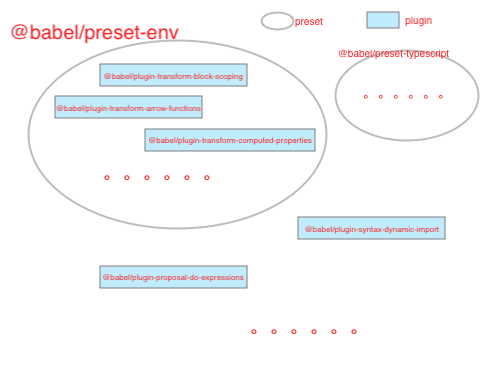

```
├── course2
    ├── lib
        ├── module
            ├── 1_module.js
            ├── 1_sub_module.js
            ├── index.html
    ├── babel6
    ├── priority
    ├── src
        ├── module
            ├── 1_module.js
            ├── 1_sub_module.js
        ├── transform
            ├── 1_example.js
            ├── 2_demo.js
    ├── .babelrc
    ├── babel.config.js
    ├── package.json
```
## babel配置文件
```json
{
   "babel": {
      "presets": [], 
      "plugins": []
   }
}
```
### presets与plugins


- plugins babel的插件具体翻译某一块功能
- preset babel插件集合的预设，包含某一部分的插件plugin
- plugins 会运行在 Presets 之前。
- plugins 会从前到后顺序执行。
- presets 的顺序则 刚好相反(从后向前)。 逆向顺序是因为大多数用户的编写顺序是 ['@babel/preset-env', '@babel/preset-typescript'] 。

##  配置文件种类
- 在`package.json`中设置babel字段
- `.babelrc` 
- `.babelrc.json`
- `.babelrc.js`
- babel6 可以在`.babelrc`引用 `.babelrc.js`, babel7不允许
- `babel.config.json` 或者 `babel.config.js`    Babel 7.x 新增的

通过 priority目录 与 babel6目录 的demo 手动调整配置。 可以得出一下结论
1. `.babelrc` 与`.babelrc.json` 及 `.babelrc.js` 不能同时使用，但babel6中可以在`.babelrc`引入`.babelrc.js`
1. 同样`babel.config.json` 与 `babel.config.js` 也不能同时使用
1. `.babelrc.js` 与 `babel.config.js` 可以共存，`.babelrc`会merge到`babel.config.js`的配置中
1. 如果在babel配置写在webpack文件中（`module.rules[x].use.options`）此外有配置了`babel.config.js`同样会进行merge 


### 案例1 编译module
1. `cnpm install --save-dev @babel/core @babel/cli @babel/preset-env`
1. `npx babel src/module --out-dir lib/module`

- 手动写一个html文件引入编译后的文件，浏览器上打开并不能正常运行
- 可以在node环境正常运行 node lib/module/1_module.js
- 如果再通过webpack处理下，就可以在浏览器运行（后面会提到course4）

从这个案例可以了解到webpack默认会进行模块化进行转换，转换成浏览器可以运行的语法，而babel默认不会做这件事情，因此初学babel最好把它与webpack区分开。


#### 案例2 动态编辑
使用`babel.transform`程序动态编译

`node src/transform/2_demo.js`

通过配置不同plugin可以了解babel转换前后的代码异同


